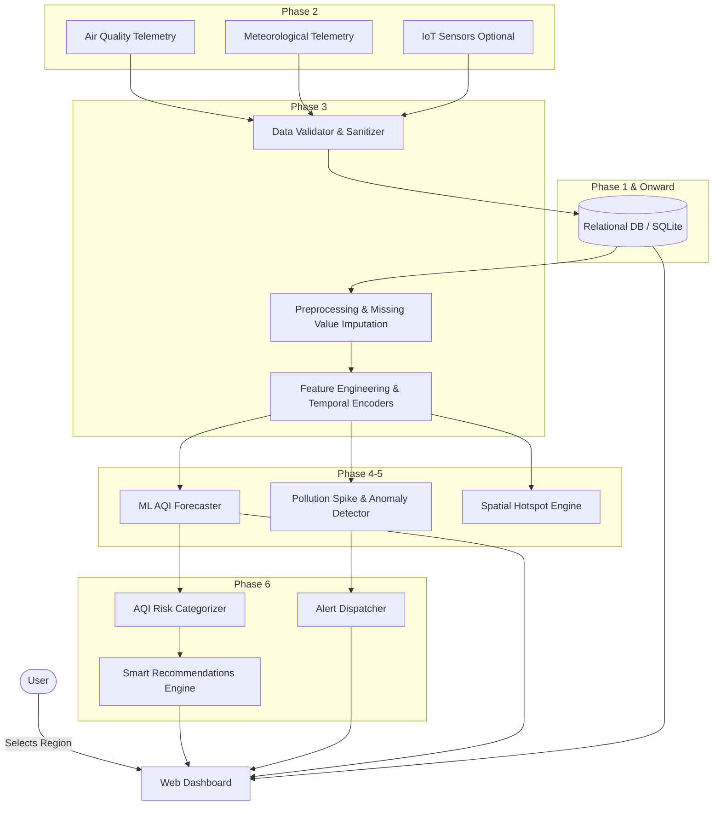
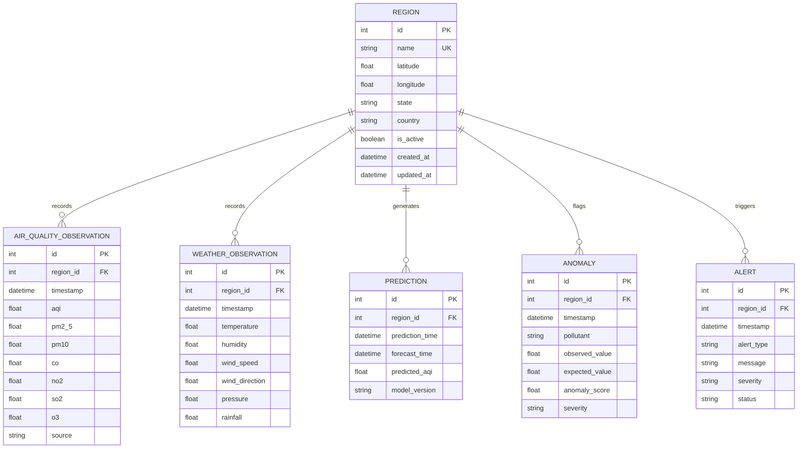

# AirGuard AI — System Architecture & Design Specification

## Overview

**AirGuard AI** is a real-time air quality monitoring and predictive intelligence platform designed for user-selected regions. The platform ingests atmospheric pollutant telemetry and meteorological variables, stores historical trends, applies machine learning models to forecast future Air Quality Index (AQI) values, flags abnormal spikes and hotspots, and presents actionable recommendations.

---

## Architectural Workflow



---

## Relational Entity Model (Phase 1 Foundation)



---

## Modular Directory Map

```text
airqualitymodel/
├── backend/
│   ├── main.py                  # Application entry point, lifespan, CORS, error handling
│   ├── routes/
│   │   ├── health.py            # /api/health endpoint
│   │   └── regions.py           # /api/regions, /api/regions/{id} endpoints
│   ├── services/
│   │   ├── region_service.py    # Region database operations & seeding
│   │   └── data_collector.py    # Architectural interface for Phase 2 data collectors
│   ├── models/
│   │   ├── models.py            # SQLAlchemy ORM models (Region & future entities)
│   │   └── schemas.py           # Pydantic schemas for data validation
│   └── utils/
│       └── logger.py            # Standardized application logging
├── config/
│   └── settings.py              # Centralized environment configuration (Pydantic Settings)
├── database/
│   ├── session.py               # Engine & sessionmaker configuration
│   └── schema/schema.sql        # Standalone SQL DDL reference
├── docs/
│   └── architecture.md          # Architecture and entity documentation
├── frontend/
│   ├── index.html               # Main dashboard UI
│   ├── components/app.js        # Frontend client logic & API bindings
│   └── styles/index.css         # Modern, responsive design system
├── ml/
│   ├── preprocessing/preprocessor.py # Phase 3 contract
│   └── prediction/predictor.py       # Phase 4 contract
├── tests/
│   └── test_phase1.py           # Comprehensive Phase 1 test suite
├── .env.example                 # Environment configuration template
├── .gitignore                   # Version control exclusion rules
├── requirements.txt             # Dependency specifications
└── README.md                    # Project documentation
```
